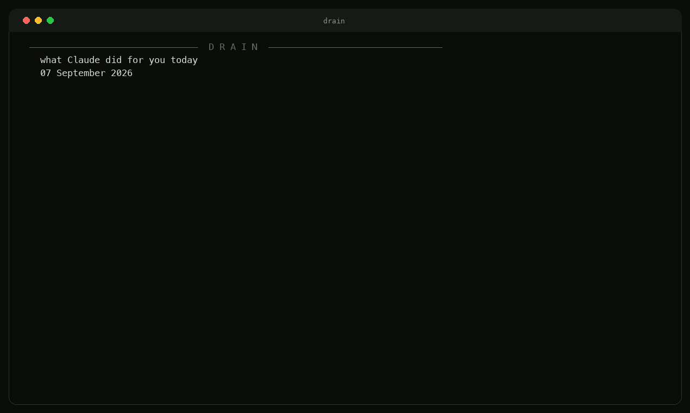
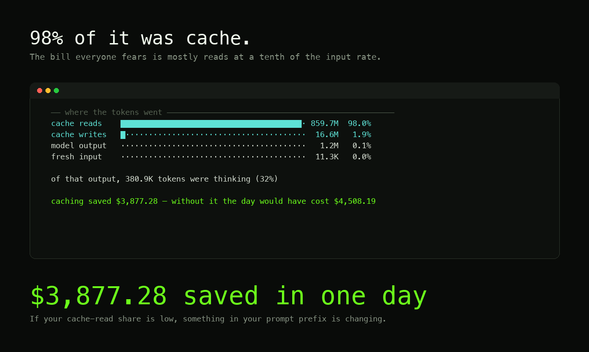
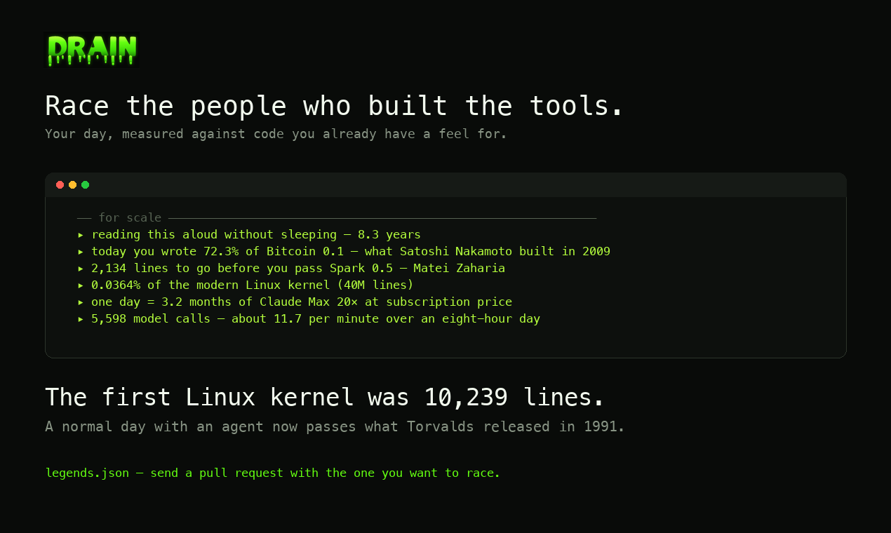

<p align="center">
  
</p>

<h3 align="center">See what Claude actually did for you today</h3>

<p align="center">
  Tokens, API-equivalent cost, commits and lines written — measured against code you<br>
  already have a feel for. Local, zero tokens spent, zero network calls.
</p>

<p align="center">
  <a href="LICENSE"></a>
  <a href="https://github.com/Azamatfg/homebrew-tap"></a>
  
  
  
</p>

<p align="center">
  
</p>

---

## ⚡ Install

**Homebrew** — macOS and Linux:

```bash
brew install Azamatfg/tap/thedrain
```

**One line, no Homebrew:**

```bash
curl -fsSL https://raw.githubusercontent.com/Azamatfg/thedrain/main/install.sh | bash
```

Installs to `~/.thedrain`, puts a `drain` command in `~/.local/bin`, and updates itself on re-run.

**From source:**

```bash
git clone https://github.com/Azamatfg/thedrain.git
cd thedrain && python3 drain.py
```

Python 3.9+. No third-party dependencies, ever.

## ▸ Use

```bash
drain                        # today
drain --date 2026-09-07      # any day
drain --json                 # machine-readable
drain --no-git               # skip repository scanning (faster)
drain --no-anim              # no count-up animation
drain --once                 # print at most once per day — for shell startup
```

Add one line to `.zshrc` or `.bashrc` and the first terminal of each day greets you with yesterday:

```bash
[[ -o interactive ]] && command -v drain >/dev/null 2>&1 && drain --once
```

## 🎯 Why

Claude Code shows you a session cost. It does not show you a **day**, it does not show you what
your subscription actually delivered, and it never connects tokens to the thing you care about —
what got built.

`drain` answers three questions at once:

1. **What did the model do?** Tokens, calls, thinking, and the cache split most people never look at.
2. **What would that have cost?** Priced per model at current API rates, cache writes and reads
   charged correctly — not one flat rate for everything.
3. **What came out of it?** Commits and lines across every git repository you touched that day.

## 🧊 The cache number is the point



Almost everyone reads "877 million tokens" and assumes a catastrophic bill. 98% of that volume is
**cache reads**, billed at 0.1× the input rate. The single most useful line `drain` prints is how
much prompt caching saved you — on the day above, **$3,877**.

If your cache-read share is low, that is a finding, not a curiosity: something in your prompt
prefix is changing between requests — a timestamp, an unsorted dict, a tool list that reorders —
and silently invalidating everything after it. **A low cache share is a bug report you have not
read yet.**

## 🏁 Race the people who built the tools



A number on its own motivates nobody. 877 million of anything is just a big number. So `drain`
compares your day to code you already have a feel for, and tells you how far you are from the
next one.

The roster lives in [`legends.json`](legends.json) — **send a pull request with whoever you want
to race.** It holds 41 projects spanning five orders of magnitude, and 38 of them were *measured*
rather than quoted: the source checked out at the tag named in the entry, physical lines counted,
vendored directories excluded. Physical lines is the unit git reports for the code you wrote,
which is the only way the comparison stays honest.

Mostly these are **first releases**, because a day of work compares to a beginning, not to a
mature project:

| | |
|---|---|
| 88 | the first commit of tinygrad — George Hotz, 2020 |
| 592 | the GPT-2 release — OpenAI, 2019 |
| 1,244 | the first commit of git — Linus Torvalds, 2005 |
| 5,096 | Keras 0.1 — François Chollet, 2015 |
| 10,239 | the Linux 0.01 kernel — Linus Torvalds, 1991 |
| 12,877 | the first commit of llama.cpp — Georgi Gerganov, 2023 |
| 43,138 | scikit-learn 0.1 — 2010 |
| 55,048 | the Doom engine — John Carmack, 1993 |
| 77,710 | PyTorch 0.1 — 2016 |
| 130,361 | the Apollo 11 guidance computer — Margaret Hamilton's team, 1969 |
| 210,394 | TensorFlow 0.5 — Google Brain, 2015 |
| 40,063,856 | the modern Linux kernel — thousands of people over 34 years |

One rule for a pull request: `exact: true` only if you measured it and said where.

## 💰 Pricing

Rates are per 1M tokens, current as of September 2026. Cache writes bill at 1.25× input for the
5-minute TTL and 2× for the 1-hour TTL; cache reads at 0.1× input (0.025× on Fable 5.1).

| Model | Input | Output |
|---|---|---|
| Fable 5.1 / Fable 5 | $10 | $50 |
| Opus 5 / 4.8 / 4.7 / 4.6 | $5 | $25 |
| Sonnet 5 | $2 | $10 |
| Sonnet 4.6 | $3 | $15 |
| Haiku 4.5 | $1 | $5 |

Unknown models fall back to Opus-tier pricing and are shown by name, so you can see what was assumed.

## 🔒 Privacy

`drain` reads `~/.claude/projects/**/*.jsonl` and your local git history. It makes **no network
requests of any kind**. There is no API key, no account, and no telemetry. Nothing leaves the
machine.

Asking a model how much you spent would be like calling the bank to read your own statement —
so `drain` spends zero tokens telling you how many you spent. Read [`engine.py`](engine.py);
it is about 110 lines.

## 📐 Accuracy, honestly

- **Subscription users pay a flat fee.** The dollar figure is API-equivalent value, not what you
  were charged. The tool says so on every run.
- **Line counts come from git** and are attributed by author, so an agent-written commit that you
  authored counts as yours — which is the point.
- **Deduplicated by message id**, so resumed and branched sessions are not double-counted.
- **Days are pinned to local midnight.** `git log --since=2026-09-09` does *not* mean "since
  midnight" — git fills unspecified fields from the current clock, so at 16:24 that flag silently
  means "since 16:24 today". Both ends of the day are pinned explicitly.

## 🤝 Contributing

The most useful contribution is a new entry in [`legends.json`](legends.json): a codebase worth
racing, with a line count anyone can verify. Pricing corrections are the second most useful —
that table is the part most likely to drift.

## License

MIT © [Azamat Bigali](https://github.com/Azamatfg)
